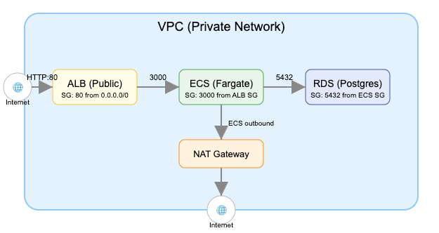

<!-- Badges/Icons -->
<p align="center">
  
  
  
  
</p>

# TODO API – Node.js, PostgreSQL, Docker & AWS

> **This is a simple TODO API project focused on demonstrating modern Infrastructure as Code (IaC) using Terraform.**

- The main goal is to show how to provision a secure, production-ready environment on AWS using Terraform.
- All infrastructure (network, security, compute, database, load balancer) is managed as code.
- The API is intentionally simple to keep the focus on the infrastructure.

---

## Available Endpoints

- `GET /todos` – List all TODOs
- `POST /todos` – Create a new TODO

**Payload for creating a TODO:**
```json
{
  "title": "title",
  "description": "description",
  "completed": false
}
```

---

## Getting Started with AWS

1. **Create a Free AWS Account**
   - Go to [aws.amazon.com/free](https://aws.amazon.com/free/) and sign up for a free account.
   - As of today, AWS offers **$200 in free credits** for new accounts (subject to change, check the AWS Free Tier page for current offers).

2. **Create an IAM User**
   - In the AWS Console, go to **IAM > Users > Add users**.
   - Give programmatic access and attach the policies: `AmazonEC2FullAccess`, `AmazonECS_FullAccess`, `AmazonRDSFullAccess`, `AmazonS3FullAccess`, `IAMFullAccess`, and `AmazonVPCFullAccess` (for testing/dev only; restrict in production).
   - Download or copy the **Access Key ID** and **Secret Access Key**.

3. **Configure AWS CLI**
   - Install the AWS CLI: https://docs.aws.amazon.com/cli/latest/userguide/getting-started-install.html
   - Run:
     ```sh
     aws configure
     ```
   - Enter your **Access Key ID**, **Secret Access Key**, default region (`sa-east-1`), and output format (`json`).

---

## Features
- RESTful API for managing TODOs
- Built with Node.js, Express, and TypeORM
- PostgreSQL as the database
- Docker Compose for local development
- Production-ready infrastructure on AWS (provisioned with Terraform)

---

## Local Development

Before starting the services, copy the example environment file:

```sh
cp .env.example .env
```

You can then run the entire stack locally using Docker Compose:

```sh
docker compose up
```

This will start both the API and a local Postgres instance. The API will be available at `http://localhost:3000`.

---

## Building and Pushing the Docker Image for AWS

Build the image for the correct architecture and push to ECR:

```sh
# Create the ECR repository (only needed once)
aws ecr create-repository --repository-name api_pg_test --region sa-east-1

# Build the image
docker buildx build --platform linux/amd64 -t <YOUR_AWS_ACCOUNT_ID>.dkr.ecr.sa-east-1.amazonaws.com/api_pg_test:latest .

# Authenticate to ECR
aws ecr get-login-password --region sa-east-1 | docker login --username AWS --password-stdin <YOUR_AWS_ACCOUNT_ID>.dkr.ecr.sa-east-1.amazonaws.com

# Push the image
docker push <YOUR_AWS_ACCOUNT_ID>.dkr.ecr.sa-east-1.amazonaws.com/api_pg_test:latest
```

---

## AWS Infrastructure (Provisioned with Terraform)

The production environment is fully managed by Terraform and includes:

- **ALB (Application Load Balancer):** Public entrypoint, receives all HTTP traffic.
- **ECS (Fargate):** Runs the API containers in private subnets. Only accessible by the ALB.
- **RDS (PostgreSQL):** Managed database in private subnets. Only accessible by ECS tasks (not public).
- **NAT Gateway:** Allows ECS tasks to access the internet (e.g., to pull images from ECR).
- **Security Groups:**
  - ALB SG: Allows inbound HTTP (80) from anywhere.
  - ECS SG: Allows inbound 3000 only from ALB SG.
  - RDS SG: Allows inbound 5432 only from ECS SG.

### High-level Architecture



---

## Security
- **RDS is not accessible from the internet.**
- **ECS tasks are not accessible directly from the internet, only via the ALB.**
- **Only the ALB is public.**

---

## Terraform variables configuration

Before running Terraform, create a file named `terraform.tfvars` at the root of the project with the following content (example values):

```hcl
db_password = "passwordmorethan8chars"
api_image   = "<YOUR_AWS_ACCOUNT_ID>.dkr.ecr.sa-east-1.amazonaws.com/api_pg_test:latest"
```

You can change these values as needed for your environment.

---

## Terraform Commands

```sh
terraform init
terraform plan -out=api-plan.tfplan
terraform apply api-plan.tfplan
```

---

## License
MIT 